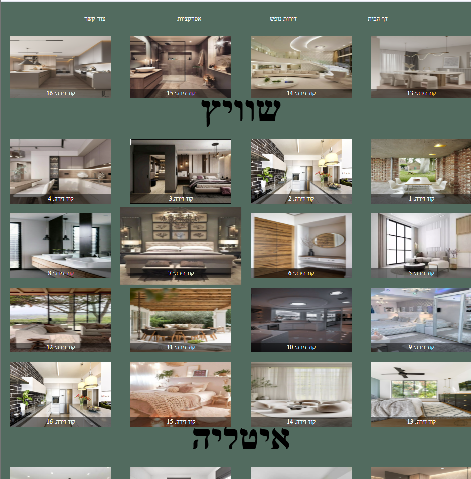
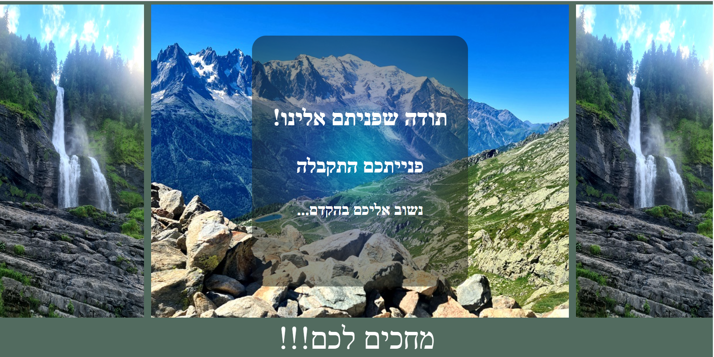
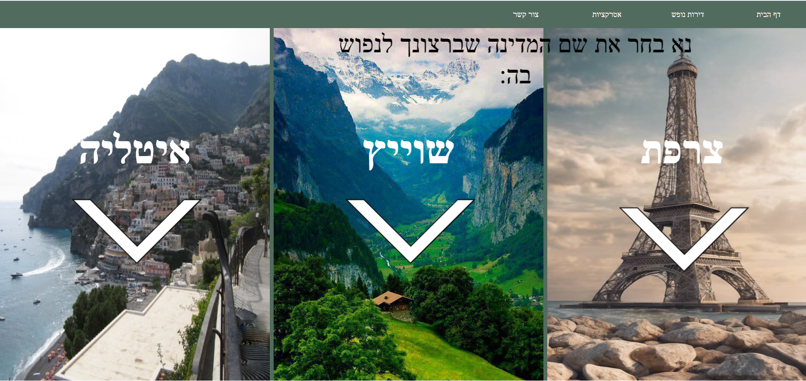
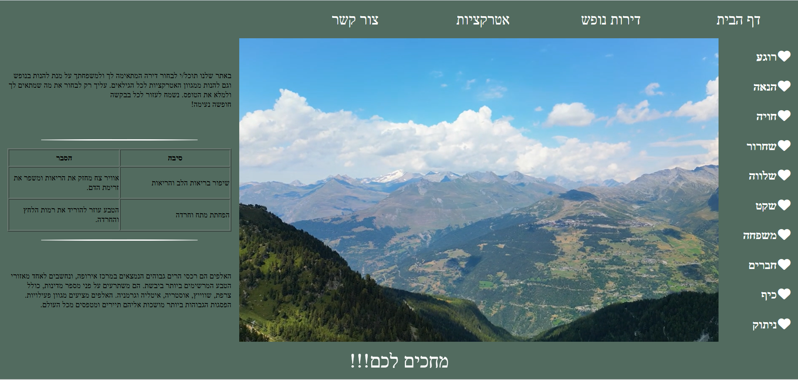

# פורטל נופש ואטרקציות באלפים

אתר רב־דפי (Multi-Page Website) המציג דירות נופש, מסלולי טיול ואטרקציות באזור הרי האלפים.  
הפרויקט מדגים תכנון מבנה תקני, ניהול פריסות מורכבות ויישום עקרונות Responsive Design תוך שמירה על היררכיה ויזואלית וחוויית משתמש עקבית.

פותח כחודשיים מתחילת לימודיי ומהווה יישום מעשי ראשון של עקרונות פיתוח Frontend.

## ארכיטקטורת האתר

- מבנה רב־עמודי עם ניווט עקבי בין עמודים  
- חלוקה ברורה לאזורים סמנטיים (Header, Main, Sections, Footer)  
- הפרדה בין מבנה (HTML) לעיצוב (CSS)  
- ארגון קבצי CSS בצורה מודולרית וקריאה  

## יכולות טכניות שבאו לידי ביטוי

- בניית פריסות רספונסיביות באמצעות Flexbox ו־Grid  
- שימוש ב־Positioning ליצירת תפריט ניווט קבוע  
- התאמת מבנה ופריסה למסכים שונים באמצעות Media Queries  
- ניהול היררכיית תוכן ויזואלית לשיפור חוויית משתמש  
- Debugging ופתרון בעיות פריסה מורכבות  

## טכנולוגיות

- HTML5 (Semantic Markup)  
- CSS3 (Flexbox, Grid, Responsive Design)  

## עקרונות פיתוח שיושמו בפרויקט

- הבנה מבנית נכונה של אתר רב־עמודי  
- שליטה בעקרונות יסוד של Frontend  
- חשיבה מסודרת ויכולת ארגון קוד  
- הקפדה על קוד נקי ותחזוקתי  

## תצוגה מקדימה

| מובייל | עמוד הרשמה | גלריית דירות | דף הבית |
| :---: | :---: | :---: | :---: |
|  |  |  |  |

## פרטי יוצר
פותח על ידי: אלה בליטי  
לשאלות בנוגע לפרויקט זה, ניתן ליצור קשר דרך GitHub או במייל